# 编写接口

## 工作区域

工作区域主要分为四个部分, `快捷操作区域` `树形导航区域` `tabs导航区域` `内容书写区域`

下图展示了文档编写的基本示意图

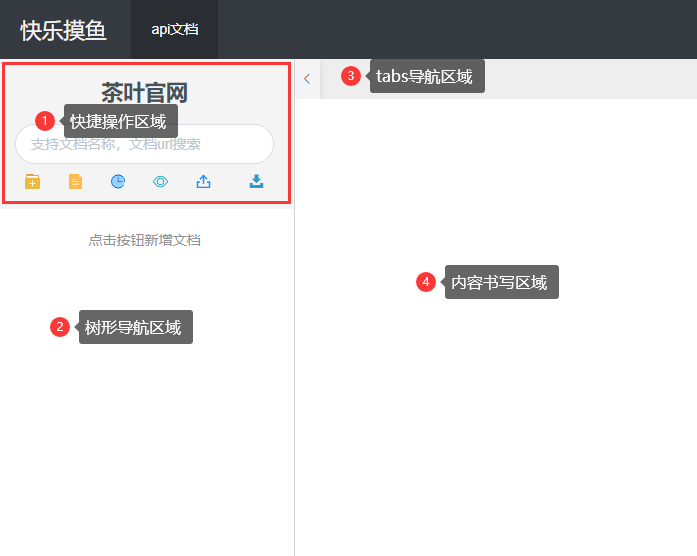

:::tip

1. 操作区域同时支持搜索`文档名称`和`文档url`
2. 操作区域操作图标从左到右依次为 `新建文件夹` `新建文档` `文档修改记录` `只读方式查看文档` `将文档导出为其他格式` `导入postman文档`
   :::

## 新建一个文档

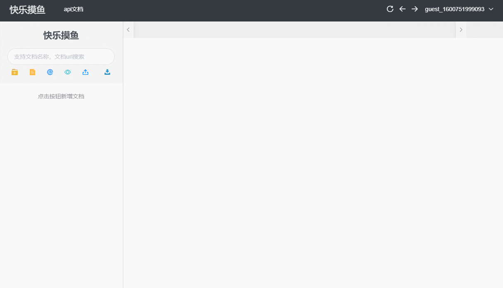

:::tip
左侧树形导航栏支持鼠标右键进行一些常规的`增删改查`功能
:::

## 树形导航常用功能

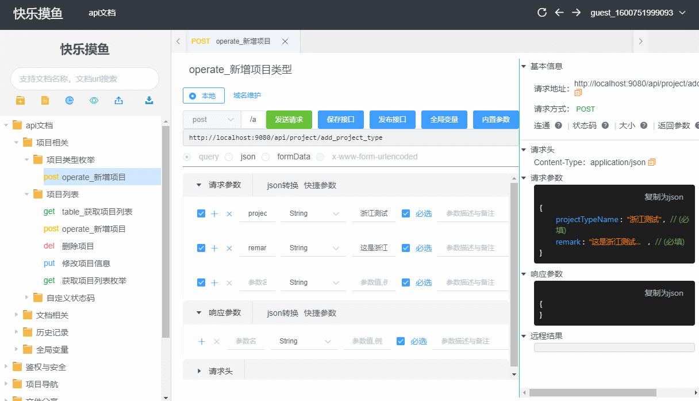

:::tip

1. 按住`ctrl + 鼠标左键`可以对文档进行批量操作
2. `F2`可以对文档进行重命名，[完整快捷方式](./b.html#快捷方式)
   :::

---

## 编写文档

接下来是接口工具比较核心的部分，在此之前我们将简单介绍一些关于**HTTP 基础与前后端交互**的相关知识，如果你对这部分内容比较熟悉可以跳过本章。

### HTTP 基础

#### URI

下面两段数据都是常见的`请求地址(标准一点应该叫统一资源标识符，后续统一称为请求地址)`，它由 `协议` `主机` `端口` `路径` `查询` `hash`这几个部分组成。[URI 参考](https://developer.mozilla.org/zh-CN/docs/Web/HTTP/Basics_of_HTTP/Identifying_resources_on_the_Web)

```
http://192.168.0.112:8080/user?id=3&sex=boy#hash
https://www.demo.com/user?id=3&sex=boy#hash

协议(http:)  常见协议 https://    http://     ws://(websocket)     wss://(加密的websocket)
主机(192.168.0.112, www.demo.com)
端口(8080)  浏览器网页默认端口号为80，默认情况下 http://demo.com 等于 http://demo.com:80
路径(/user)

```

:::tip
在接口文档中我们将一个完整 URL 定义为两个部分

1. 服务器地址(协议+ip 或则域名+端口)
2. 路径

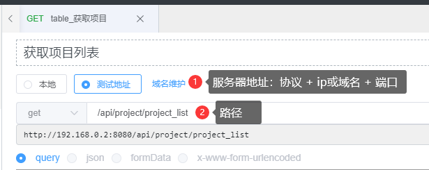
:::

#### 请求方式

常用请求方式：`GET` `POST` `PUT` `DELETE`。

GET 请求只支持以`查询字符串`方式进行传值，http://demo.com/user?<font color="#f60">id=2&name=shu</font> 。

#### 发送数据类型

常见传输数据 `查询字符串` `form-data` `application/json` `x-www-form-urlencoded`

:::warning

1. 接口工具只支持 `查询字符串` `form-data` `application/json`
2. 发送数据类型只允许 1 种，多种传输类型会让接口变得难以维护。
3. 文档不再支持`x-www-form-urlencoded`传输格式，json 格式的数据传输已经很方便了，单一的传输格式能够减少前后端沟通。
   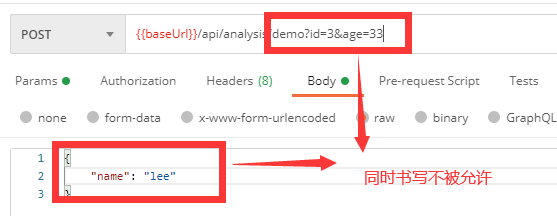
   :::

---

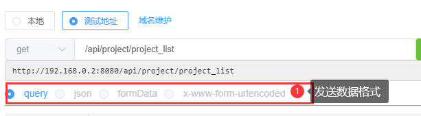

### 请求参数

下图是请求参数录入区域示意图
1. json转换(将json数据转换为请求参数)
2. 应用模板(将模板应用为请求参数)
3. 保存为模板(将当前请求参数保存为模板)
4. 请求参数录入
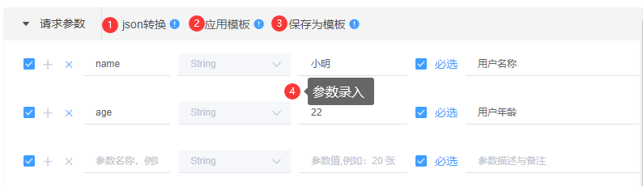
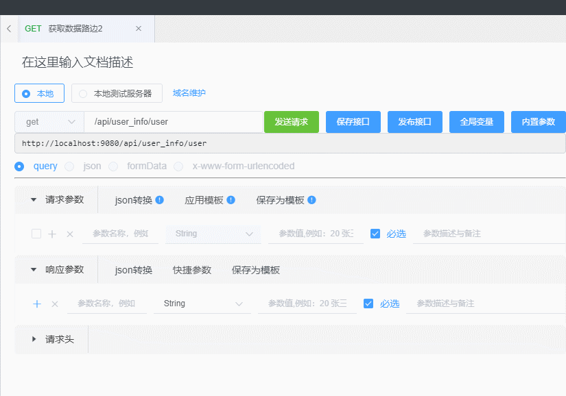
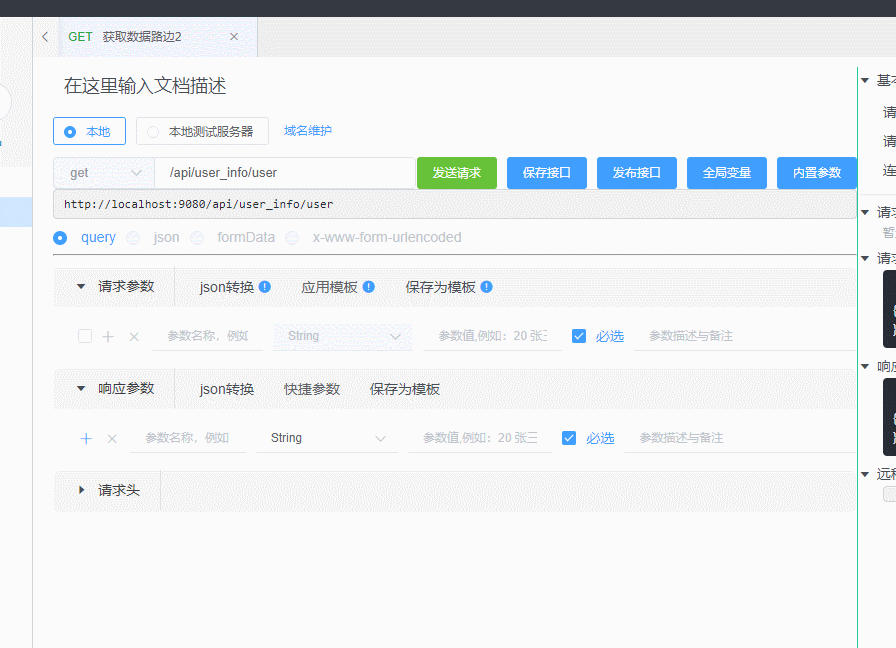
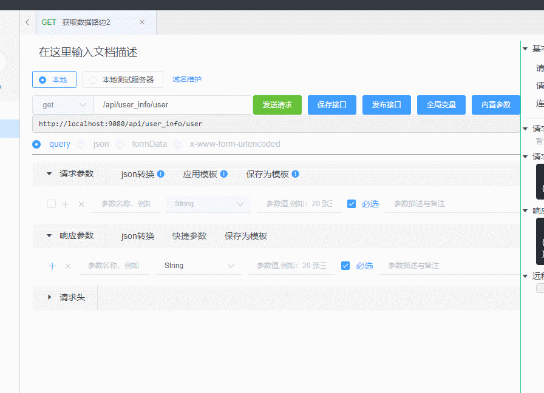

目前支持的数据类型：
1. String(字符串)
2. Number(数字，不区分整型和浮点型)
3. Array(数组，List)
4. Boolean(布尔值)
5. Object(对象)
6. File(文件，必须以 formData 形式传输)

:::tip
1. 对于一个项目，字段录入一次以后将会被系统记录，下次录入可以直接引用上次录入记录。
2. 支持`moustache`变量插入
:::

### 返回参数
返回参数录入方式与请求参数相同

### 发送与保存请求
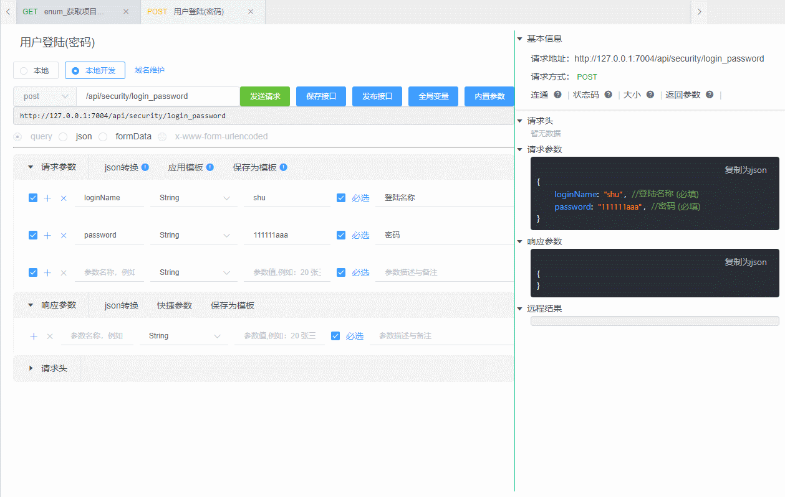


### 发布接口
接口发布视作前后端<font color="#f60"> 正式联调 </font>必要条件，在此之前前端可以通过mock数据进行测试。
接口发布意味着<font color="#f60"> 后端逻辑已经完成 </font>并且系统自动校验<font color="#f60"> 实际返回值与约定是否一致 </font>，减少沟通成本。

:::tip
1. 无任何修改的接口多次发布视作一次发布
2. 每次接口发布都拥有详细历史记录，可以在接口修改记录中查看变更信息
:::

### 全局变量

有时我们发送请求时候需要带上一些权限认证信息(token,cookie)，大部分请求都需要携带认证信息，如果每个接口都写死认证信息，那么当认证过期以后又需要手动更改每个认证信息。有了变量以后，认证信息过期只需要更改变量值就行了。
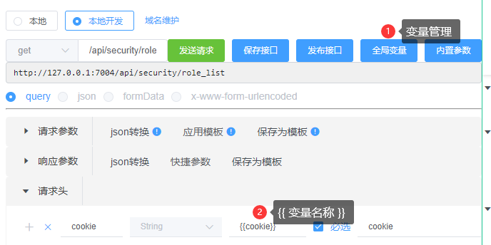

## 快捷方式

| 快捷键          |   效果   |                作用区域 |
| --------------- | :------: | ----------------------: |
| ctrl + s        | 保存文档 |  接口文档(文档编辑区域) |
| ctrl + 鼠标左键 | 多选文档 | 接口文档(树形导航区域)) |
| F2              |  重命名  |      接口文档(选中文档) |
